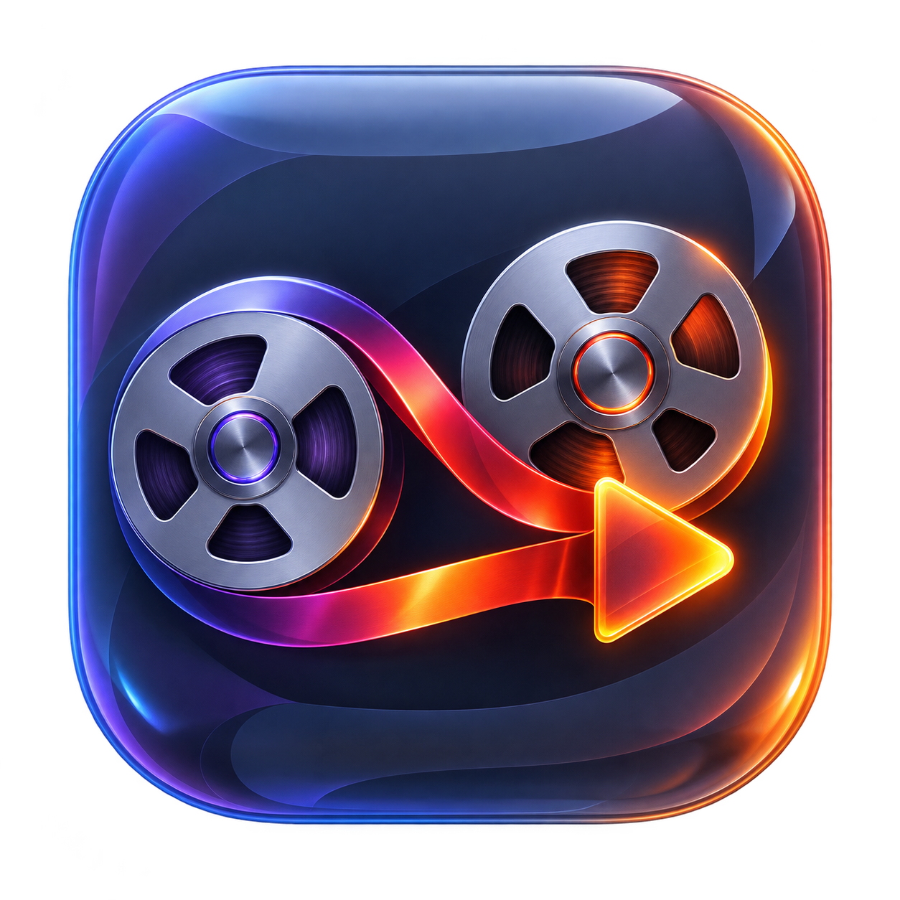
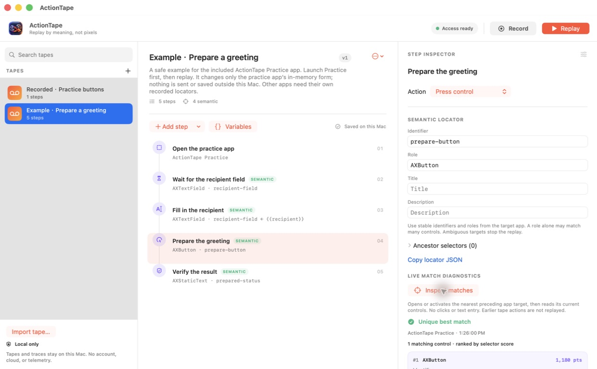
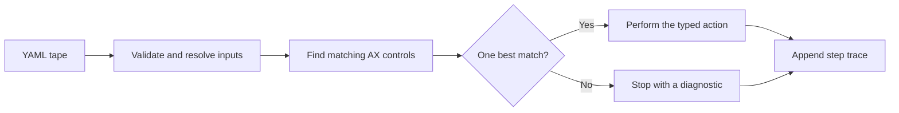

<div align="center">
  
  <h1>ActionTape</h1>
  <p><strong>Replay by meaning, not pixels.</strong></p>
  <p>A native macOS studio for recording, editing, and debugging desktop workflows.</p>
  <p>
    
    
    <a href="https://github.com/jovial-liu/ActionTape/actions/workflows/ci.yml"></a>
    <a href="LICENSE"></a>
    
  </p>
</div>

Move a window. Replay the same tape. A button is still a button.

ActionTape targets macOS controls through their Accessibility identity: identifier,
role, title, description, and ancestors. Record clicks across selected apps, edit
the resulting steps in a native SwiftUI studio, then replay with a live trace.
The same readable YAML runs from the command line.

Think **Playwright for your Mac**: semantic actions, explicit assertions, and
failures you can inspect. No account or model API is needed.



*The running macOS app, inspecting the included Practice workflow.*

> [!NOTE]
> **v0.1.0 is a source preview.** Build it locally with Swift 6 on macOS 14+.
> The packaging scripts produce development apps for your Mac's architecture;
> they do not add a Developer ID signature or notarization. See the
> [release notes](docs/releases/v0.1.0.md) for current limitations.

## What you can do

- **Record across apps.** Select the running apps to include, capture supported
  clicks and app switches, and stop from a floating control. Text fields and
  keystrokes are excluded from recording.
- **Edit every step.** Add, duplicate, reorder, or delete actions; edit locators,
  text, shortcuts, timeout, and retry settings. Drafts save to your local library.
- **Reuse a tape.** Define `{{variables}}`, supply inputs for each replay, and
  enter secret inputs without saving a default in Studio.
- **See what happened.** Follow per-step status, attempts, timing, and errors;
  export a value-redacted JSON trace. **Inspect matches** shows ranked candidates
  and score explanations for a locator without pressing the control.
- **Use the terminal too.** Validate, dry-run, inspect a control, replay, or
  export a trace through the same core engine used by Studio.

Missing or ambiguous targets fail with a diagnostic. Every supplied locator
criterion must match; coordinates are an explicit opt-in compatibility feature.

## Try it with the included Practice app

The quickest first run uses **ActionTape Practice**, a small native app included
in this repository. It prepares a label in memory using synthetic data. Nothing
is sent, saved, or purchased.

Requirements: macOS 14+, and Xcode 16 or another compatible Swift 6 toolchain.

```bash
git clone https://github.com/jovial-liu/ActionTape.git
cd ActionTape
swift build
swift test

bash scripts/package-practice-app.sh
open 'dist/ActionTape Practice.app'
```

Validate the tape and its inputs before replaying:

```bash
swift run actiontape validate examples/practice-label.yaml
swift run actiontape run examples/practice-label.yaml --dry-run
swift run actiontape doctor
```

For replay, grant Accessibility access to the executable or terminal host macOS
identifies. `swift run actiontape doctor --request-access` requests the system
prompt. Studio has its own permission grant.

```bash
swift run actiontape run examples/practice-label.yaml \
  --variable 'recipient=Ada Lovelace' \
  --trace .build/practice-trace.json
```

You should see **Prepared** in the Practice app and four successful steps. Reset
the Practice form, move its window, and replay the same tape to try semantic
targeting yourself.

To use the native Studio:

```bash
bash scripts/package-app.sh
open .build/artifacts/ActionTape.app
```

Open the Practice tape in Studio, inspect its steps, then replay. To record your
own tape, open **Record**, choose the apps to include, and interact with supported
buttons. Add text and shortcut steps manually afterward. See the
[Studio guide](docs/studio-guide.md).

Yams 6.2.2 and libyaml are [vendored with their licenses](Vendor/Yams/NOTICE.md).
An existing checkout builds without dependency downloads. The offline check
repeats this in a clean build directory with network access denied:

```bash
bash scripts/check-offline-build.sh
```

## A tape is a reviewable file

This is the central part of [the Practice tape](examples/practice-label.yaml):

```yaml
formatVersion: 1
name: Prepare a practice label
steps:
  - id: activate-practice
    action: activateApp
    app:
      bundleIdentifier: com.jovial-liu.ActionTape.Practice

  - id: enter-recipient
    action: setValue
    locator:
      role: AXTextField
      identifier: recipient-field
    value: Ada Lovelace

  - id: prepare-label
    action: press
    locator:
      role: AXButton
      identifier: prepare-button

  - id: verify-prepared
    action: assertExists
    locator:
      role: AXStaticText
      identifier: prepared-status
```

Supported actions are `activateApp`, `press`, `setValue`, `hotKey`, `waitFor`,
`assertExists`, and `pause`. Add named variables, bounded timeouts, and explicit
retry policies as needed. Read the [tape format](docs/tape-format.md) for details.

## CLI at a glance

```bash
swift run actiontape --help
swift run actiontape validate examples/practice-label.yaml --json
swift run actiontape run examples/practice-label.yaml --dry-run
swift run actiontape inspect --point 640,360
swift run actiontape doctor
```

`inspect` prints a semantic locator for the element under a screen point without
clicking it. Repeat `--variable name=value` for run inputs, or use
`--variable-env name=ENV_VAR` to read an existing environment variable without
putting its value in the command line. Press Control-C to cancel a CLI run.

The CLI's `--trace` writes JSON with ISO 8601 timestamps and owner-only file
permissions. Traces omit resolved inputs and `setValue` contents; workflow
names, step IDs, and UI diagnostics can still identify private information.

## How it works



Studio and the CLI both use `ActionTapeCore`. All explicit locator fields are
constraints. Ranking chooses among matching candidates; a top-score tie is an
error. A tape stays associated with its activated application so an unrelated
foreground window does not silently become the target.

See [architecture](docs/architecture.md) and
[application compatibility](docs/compatibility.md). The
[verification notes](docs/verification.md) distinguish live Practice checks from
fixture tests and bundle verification.

## Scope of this preview

Recording currently supports app activation and controls with `AXPress`. Typing,
dragging, scrolling, and other interactions are not automatically recorded.
Manual authoring supports text and hotkeys. Traces do not yet include screenshots
or Accessibility-tree diffs.

Accessibility quality varies between apps, versions, and languages. Custom-drawn
controls may expose no usable semantics. Practice provides a controlled first
example; the [Finder, TextEdit, and Notes examples](examples/README.md) are format
demonstrations that may need adjustment for your setup. Automated checks verify
source, fixtures, example formats, and app assembly; they do not run a broad
desktop compatibility matrix.

Accessibility access is broad. Review a tape as you would a script: it can change
another app or trigger that app's network activity. Tape files are plaintext,
and even a value-redacted trace may contain private control labels. The current
app has no telemetry, cloud runner, or runtime network requirement. Read
[security and privacy](docs/security-and-privacy.md) before automating sensitive
workflows.

## Build with us

The next priorities are richer assertions, interactive locator repair, broader
recording, and signed distribution. The [roadmap](ROADMAP.md) distinguishes
shipped code from planned work.

Useful contributions include reproducible app-compatibility reports, synthetic
Accessibility fixtures, and focused UX improvements. Start with
[CONTRIBUTING.md](CONTRIBUTING.md). Report vulnerabilities through
[SECURITY.md](SECURITY.md), and keep private traces out of public issues.

[Local packaging](docs/packaging.md) · [Studio guide](docs/studio-guide.md) ·
[Tape reference](docs/tape-format.md) · [Examples](examples/README.md) ·
[Changelog](CHANGELOG.md)

ActionTape is [MIT licensed](LICENSE). Yams and libyaml retain their respective
MIT notices. Copyright © 2026 jovial-liu.
