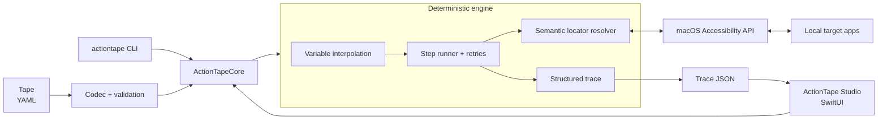

# Architecture

ActionTape is designed as a local, deterministic automation stack. A YAML tape
has the same meaning whether it is opened in Studio or invoked from the CLI;
both surfaces delegate to the shared Swift core.

There is no LLM or cloud service in this execution path. The only third-party
library is the vendored Yams 6.2.2 YAML implementation, including libyaml;
SwiftPM uses a local path dependency. Building or testing an existing source
checkout requires no dependency download, and current runtime behavior does
not require a network service. The toolchain must already be installed.

## Components

### ActionTapeCore

The shared library owns the serialized model, validation, variable
interpolation, semantic locator ranking, execution policy, and structured run
result. Core types are `Sendable` value types so Accessibility objects do not
leak into stored tapes or traces.

The locator resolver uses available identifier, role, title, description, and
ancestry signals. It fails on indistinguishable top candidates instead of
silently clicking one. Every supplied field must match, including title and
description when an identifier is also present. Ranking distinguishes matching
candidates; it does not turn a failed field constraint into a match.

### Accessibility boundary

The macOS Accessibility API is the adapter between semantic locators and local
applications. This is a privileged boundary: Accessibility access can inspect
and control UI across applications. ActionTape's model does not persist the
Accessibility value attribute in element snapshots, and step traces do not
include `setValue` contents. Locator titles and diagnostic messages can still
be sensitive.

Coordinate fallback is represented for compatibility but disabled by default.
It is not part of normal resolution and examples intentionally omit it.

### ActionTape Studio

Studio is the native SwiftUI surface for keeping a local tape library,
import/export, editing steps and variables, semantic click recording, running
tapes, and inspecting a live step timeline. The source preview records app
activation and supported clicks only from selected applications. Text and
hotkeys can be authored manually; typing is not automatically recorded. Secret
inputs are requested per run and not written as defaults by the variable editor.
Traces do not yet provide screenshots or Accessibility-tree diffs.

The SwiftPM executable product is `ActionTapeStudio`, distinct from `actiontape`
on case-insensitive macOS filesystems. Packaging installs that product as the
`ActionTape.app` bundle's executable.

### ActionTape Practice

The separate native Practice app exposes stable Accessibility identifiers for
a synthetic label form. It has no persistence or network behavior, allowing
first-run verification without modifying a user's documents or cloud accounts.

### `actiontape` CLI

The CLI exposes the same codec and runner for validation, point inspection,
local execution, and automation-friendly trace output. `ActionTapeCLIKit`
contains the dependency-free argument parser and command executor, while
`ActionTapeCLI` owns the entry point. Run `swift run actiontape --help` to
discover the exact surface supported by a checkout.

## Determinism contract

ActionTape's intended contract is straightforward:

1. Parse a versioned tape and reject invalid input before acting.
2. Resolve variables from explicit run inputs or declared defaults.
3. Resolve each target through Accessibility semantics.
4. Fail safely if a target is missing or ambiguous.
5. Apply bounded timeout and retry policy.
6. Emit one ordered trace entry per attempted step without input values.

Determinism does not mean every tape is portable across every app version.
Applications can change their Accessibility trees, identifiers, or localized
labels. It means ActionTape does not ask a probabilistic model to reinterpret a
tape at run time and does not silently select an ambiguous element.

## Data flow and persistence

- A tape is user-authored YAML and may contain plaintext input defaults.
- Runtime variable values are held in process memory while a tape runs.
- A trace contains workflow/step status, action kind, attempts, timing, and an
  optional diagnostic message. It intentionally excludes variable values and
  `setValue` text.
- The current architecture has no telemetry path.

See [security-and-privacy.md](security-and-privacy.md) before automating an app
that handles confidential information.
